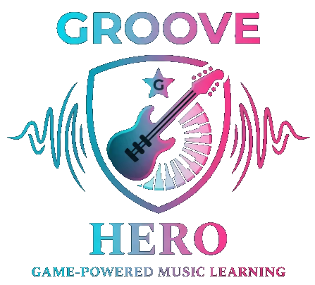

<p align="center">
  
</p>

A browser-based rhythm piano game inspired by Guitar Hero and VRTuos, designed especially for beginners learning to play piano.

Blocks fall from the top of the screen toward a hit line aligned with an interactive piano keyboard, helping players develop timing, coordination, and note recognition in a fun and visual way.

---

## 🚀 Getting Started

### Run locally

```bash
npm run dev -- --open
```

Wait for the browser to open automatically and load the game.

---

## 🎵 Adding Songs

1. Add `.mid` or `.midi` files to:

   ```
   static/musics/
   ```

2. Generate the database:

   ```bash
   npm run create-db
   ```

3. JSON files will be created in:

   ```
   static/database/
   ```

### 🎼 MIDI Sources

* https://github.com/lucasnfe/adl-piano-midi (general collection)
* https://animezen.net/midis (anime songs)

---

## 🎮 Features

* **Beginner-friendly UI**
  Clean and intuitive interface with simple controls.

* **Adjustable difficulty**
  Control how fast notes fall to match your skill level.

* **Customizable keyboard**

  * Change number of keys
  * Adjust key width

* **Playback controls**

  * Loop songs
  * Scrub timeline
  * Jump to any section

* **Speed control**
  Play from **0.25× to 5× speed** (instant changes, no restart needed)

* **Sound modes**
  Toggle between:

  * Sound mode
  * Music mode

* **Compact keyboard mode**
  Switch between compact and full layouts.

---

## 🖥️ Setup Tips (Best Experience)

For a more immersive experience:

* Use a **projector above your piano**
* Or place a **large screen/TV above the keyboard**
* Align the on-screen keys with your real piano keys
* Adjust key count and width to match your instrument

You can also:

* Mirror your screen to a TV
* Use port forwarding to access the app from another device

---

## 🌐 Browser Support

Works on all modern browsers that support:

* Web Audio API
* CSS `transform`

Tested on:

* Chrome
* Firefox
* Safari
* Edge
* WebOS Browser

---

## 🔮 Future Plans

If the project gains traction, planned features include:

* 🎤 **Real-time input detection**
  Capture audio from a physical piano/keyboard

* 🎯 **Accuracy feedback system**
  Detect correct vs incorrect notes

* 🏆 **Scoring system**
  Provide performance metrics and progression

---

## ❤️ Contributing

Feel free to fork the project, open issues, or submit pull requests.
Ideas, feedback, and improvements are always welcome!

---

## 📌 Notes

This project started as an experiment using AI-assisted ("vibe") coding — and evolved into a practical learning tool for piano beginners.

---

<p align="center">
  Made with 🎵 and curiosity
</p>
